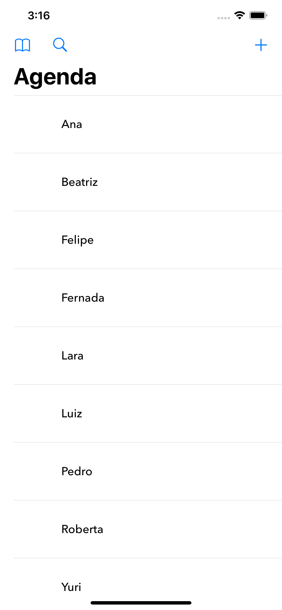
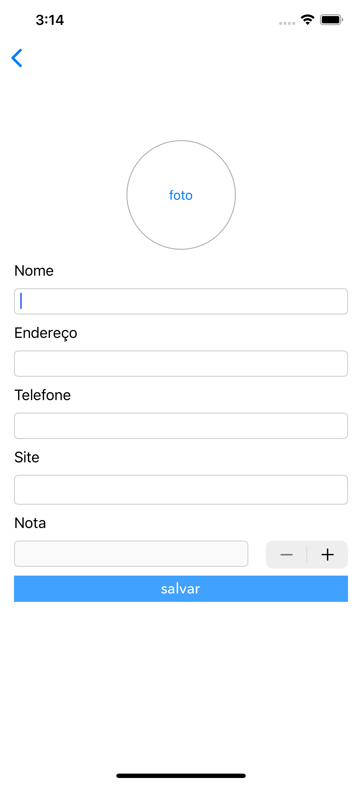
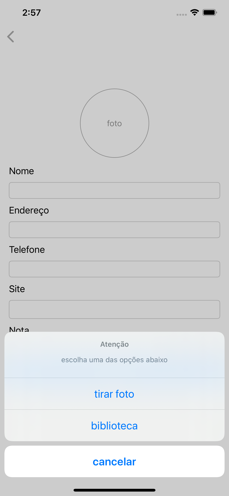
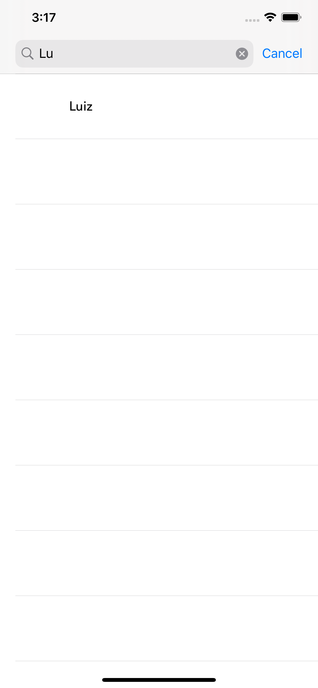
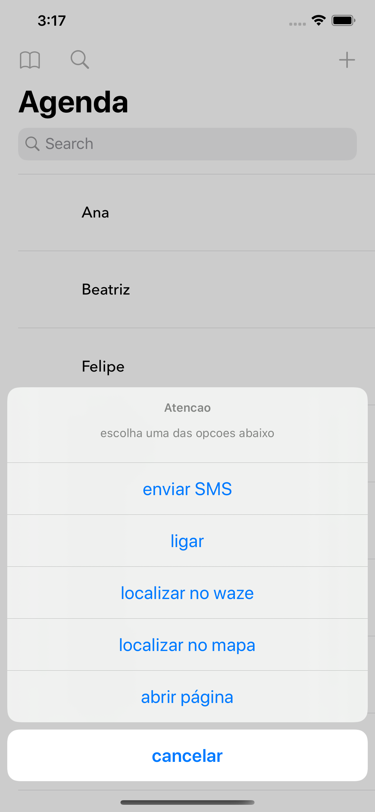

<h1 align="center">
  Agenda
</h1>

Aplicativo desenvolvido ao longo de alguns cursos de Swift da Alura.

<!-- 

 -->

<!-- 

 -->

## 👨🏼‍💻 Desenvolvedor

- [Luiz Henrique](https://github.com/luizhsou1)

## 🚀 Tecnologias

- [Swift](https://www.apple.com/swift/)
- [Firebase](https://firebase.google.com/)
- [Alamofire](https://github.com/Alamofire/Alamofire)
- [Spring](https://spring.io/)

## ✋🏻 Pré-requisitos

- Ambiente configurado com Xcode e CocoaPods instalado.
- Java 8 ou posterior instalado (Para executar o servidor)

## 🔥 Instalação e execução

1. Faça um clone desse repositório;
2. Entre na pasta `cd agenda`;
3. Rode `pod install` para instalar as dependências;
4. Rode `java -jar server/server.jar` para executar o servidor;
5. No arquivo info.plist altere o host da chave UrlPadrao para o seu ip (obs.: O dispositivo deve estar usando a mesma rede do servidor)
6. Execute o projeto no Xcode

## ⚡️ Aprendizados adquiridos

- Manipulação de recursos nativos:
  - câmera/biblioteca de fotos do iOS;
  - persistência de objetos no Core Data;
  - envio SMS;
  - ligação telefônica;
  - localização e mapa;
  - autenticação local do iOS;
  - atalho para o app com 3D Touch;
  - abrir página da web;
- Integração com Web Service:
  - utilizar CocoaPods para gerenciar depêndencias do projeto;
  - utilização do Alamofire para fazer requisições HTTP;
  - implementação de CRUD junto a servidor;
  - sincronização de informações quando não estiver internet;
- Integração com Firebase:
  - configurar o serviço de Push Notification;
  - solicitar certificado de uma autoridade certificadora através do Key Chain;
  - gerar certificado de push notification no apple developer;
  - manipular pacote do firebase para receber mensagens em tempo real com o Cloud Messaging;
